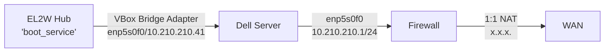
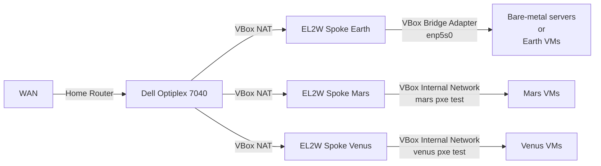
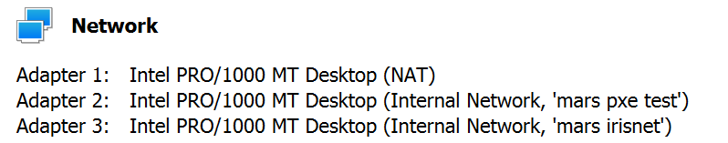
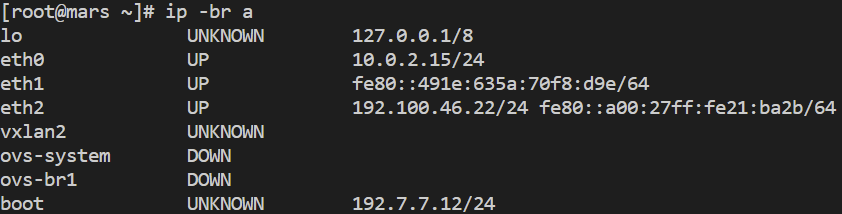
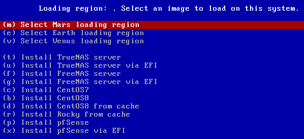

# EL2W: Extended Layer 2 Services for Bare-Metal Provisioning Over WAN

This repository contains the source code and scripts implementation of our paper. [Paper link](https://ieeexplore.ieee.org/document/10207539)

    .
    ├── common                      # config files and scripts for both hub and spoke
    │   ├── etherate_patch              # Etherate patch for the Etherate tool
    │   ├── Juno                        # juno hostnames and ips
    │   ├── strongswan                  # strongswan config
    │   ├── boot_service                # script to start EL2W services for remote provisioning
    │   ├── el2w_create                 # script to create a EL2W port on the system
    │   └── etherate_service            # script to start EL2W services for remote etherate testing
    ├── hub                         # config files for Hub
    │   ├── boot_service_conf           # php, pxe, ks, configs for boot service
    │   ├── duo_conf                    # Hub DUO configs (add 'pam_duo.conf' from your Duo Unix application)
    │   ├── supervisor_conf             # supervisord configs
    │   ├── doit.sh                     # embedded script in Vagrantfile
    │   └── Vagrantfile                 # Vagranfile to run vagrant up
    ├── spoke                       # Vagrantfile and embedded script to run during vagrant up
    │   ├── Earth                       # Spoke Earth
    │   ├── Mars                        # Spoke Mars
    │   └── Venus                       # Spoke Venus
    ├── timing_tests                # config files, scripts, and timing test results
    │   ├── hub                         # test vagrant up on hub
    │   │   ├── isos                    # local copies of isos (not included in repo)
    │   │   │   ├── centos8.iso         #
    │   │   │   ├── freenas.iso         #
    │   │   │   ├── pfsense.iso.gz      #
    │   │   │   ├── rocky.iso           #
    │   │   │   └── truenas.iso         #
    │   │   ├── result                  # run log and timing log
    │   │   ├── run.sh                  # run script for Hub vagrant up timing test
    │   │   └── Vagrantfile             # modified vagrantfile uses local isos to avoid downloading
    │   └── spoke                       # test vagrant up on spoke Mars
    │       ├── result                  # run log and timing log
    │       ├── hub_pamd_sshd           # /etc/pam.d/sshd used on Hub to bypass DUO 2FA
    │       ├── hub_sshd_config         # /etc/ssh/sshd_config used on Hub to bypass DUO 2FA
    │       └── run.sh                  # run script for Spoke vagrant up timing test
    ├── make_hub.sh                 # script to prepare `mhub` dvir for vagrant up hub
    ├── make_spoke.sh               # script to prepare `mspoke` dir for vagrant up spoke
    └── README.md                   # readme

### Special notes: The software we used as a part of our system: Etherrate, iPXE, and a patch we modified that was authored by Oliver Chirossel, are available at the following links:  
- The Etherate tool source code by Bensley is avaiable at: [https://github.com/jwbensley/Etherate](https://github.com/jwbensley/Etherate)
- The iPXE source code is avaiable at: [https://github.com/ipxe/ipxe.git](https://github.com/ipxe/ipxe.git)
- The iPXE patch created by Chirossel is retrived and modified from: [https://lists.ipxe.org/pipermail/ipxe-devel/2016-December/005292.html](https://lists.ipxe.org/pipermail/ipxe-devel/2016-December/005292.html)

## Get started
To set up and test EL2W service, two machines with VirtualBox and Vagrant is needed.
<br/>The specs used for the hub and spoke are:

| Role       | Machine             | CPU                       | RAM  | Storage                | OS                 | VirtualBox | Vagrant |
| ---------- | ------------------- | ------------------------- | ---- | ---------------------- | ------------------ | ---------- | ------- |
| EL2W Hub   | Dell PowerEdge R620 | Intel(R) Xeon(R) E5-2643  | 32GB | SCSI Disk 2TB (RAID 0) | Ubuntu 20.04.5 LTS | 6.1.42     | 2.3.4   |
| EL2W Spoke | Dell Optiplex 7040  | Intel(R) Core(TM) i7-6700 | 16GB | WD BLACK SN750 500G    | Ubuntu 20.04.5 LTS | 6.1.42     | 2.3.4   |

First, download and install Virtualbox and Vagrant. on both hub server and spoke machine(s). <br/>
- [VirtualBox v6.1.42](https://www.virtualbox.org/wiki/Download_Old_Builds_6_1)
- [Vagrant v2.3.4](https://developer.hashicorp.com/vagrant/downloads)

Then, follow the DUO 2FA official documentation to obtain the `pam_duo.conf` file and add to `hub/duo_conf` directory.
- [Duo Configuration](https://duo.com/docs/duounix#duo-configuration)
## Set up EL2W hub

A simple diagram shows the network configuration of EL2W hub deployment in this work. The Dell server is connected to a firewall via `enp5s0f0` with a private IP `10.210.210.41` and default gateway `10.210.210.1`. The firewall has a `1:1 NAT` to map the public IP `x.x.x.x` to the hub's private IP.


In `common/juno/hosts`, change the public IP address of sun to match the hub's public IP address
```bash
192.100.42.20 earth.localdomain earth
192.100.44.21 venus.localdomain venus
192.100.46.22 mars.localdomain mars
x.x.x.x sun.localdomain sun             # change the public IP address
192.100.88.10 olympus.localdomain olympus
```

In `common/el2w_create`, change the private IP address to match the private IP
```bash
# 1.1 Configure hostfile
if [ $VAGRANT_ROLE == "hub" ]; then
  m4 -DSUN_IPADDR="10.210.210.41" /vagrant_data/strongswan/hosts.m4 >/etc/hosts # change the private IP here
fi
```

In `hub/Vagrantfile`, change the bridge adapter interface according to the host interface configuration
```bash
# 1. String identifying host interface for Vagrant to create bridge to
BRIDGE_INTERFACE = "enp5s0f0"                   # change the bridge interface
```

In `hub/Vagrantfile`, change the private IP address and routing rule to meet hub server's local network configuration in stage 3
```bash
# Stage 3 - set up network security rules
# Network routing rules and DNS
ip addr flush dev eth1
##### change the private IP address and routing rule to suit local network configuration #####
ip addr add 10.210.210.41/24 dev eth1           # change the private IP and netmask
ip route delete default
ip route add default via 10.210.210.1 dev eth1  # change the routing rule
```

After update the above steps based on the deployment network configurations. Running the following command under the project root directory will create a `mhub/` directory under the project root directory with required files to launch the EL2W hub.
```
./make_hub.sh
```

Now, launch the EL2W hub using
```
cd mhub/ && vagrant up
```

After the above command finishes executing, a running EL2W hub can be accessed under `mhub/` directory using
```
vagrant ssh -- -p 12345
```

## Set up EL2W spoke(s)
The spoke(s) network configuration used in this work is illustrated in the diagram below. 
> The Earth spoke is configured to be able to connect to both bare-metal servers or VBox VMs using a physical bridge adapter interface on the host laptop. In our work, the interface is a ``. <br/><br/>
> Note: VirtualBox will only recognize the interface when it's **connected and active**. <br/>
> The **TCP/IPv4 properties** for this interface is disabled in Windows for the layer-2 service to be successfully extended.



In `spoke/Earth/Vagrantfile`, change the bridge adapter interface according to the host interface configuration
```bash
# 1. String identifying host interface for Vagrant to create bridge to
BRIDGE_INTERFACE = "enp5s0" # change the bridge interface
```

Now we can launch a spoke (spokes) to extend the hub's layer-2 services. Pass the spoke's name to create the corresponding spoke using `./make_spoke.sh <Mars|Earth|Venus>` to create the `mspoke/` directory. 

For example, under the project root directory, running the following command will create a `mspoke/` directory under the project root directory with required files to launch spoke Mars.
```
./make_spoke.sh Mars
```

Now, launch the EL2W spoke Mars using
```
cd mspoke/ && vagrant up
```

After the above command finishes executing, a running EL2W hub can be accessed under `mspoke/` directory using
```
vagrant ssh
```

After the spoke is built, a `Spoke is up` prompt will show in the terminal indicating the EL2W spoke is established and a boot service is extended from the hub to the spoke for remote provisioning over WAN. An Ethernet port on the spoke is exposed for connecting to the bare metals, or VMs. The Ethernet port is also bridged with the `boot` port on the EL2W spoke VM on the same Ethernet broadcast domain. 

To demonstrate the spoke built using VBox internal network, take building spoke Mars on Windows as an example. The Ethernet port is listed as the ***Adapter 2*** under the VM's Network section as an Internal Network named ***'mars pxe test'***.



Inside the spoke Mars VM, the Ethernet port is `eth1` without an IPv4 address.



Connect the bare metals or VMs to the `eth1` adapter from the Mars spoke and boot via network. The iPXE boot menu will be chainloaded for selecting spoke regions and operating systems. The screenshot below is the boot menu from booting a bare VM.



## How to replicate the timing tests
The `timing_tests/` directory includes the configurations and scripts for replicating the results in the paper.
### Timing tests for EL2W hub
Under `timing_tests/hub/` directory, create an `isos/` directory, use the download links to pre-download the OS images, and rename the ISO to the following names listed in the table. 

| OS      | File Name        | URL                                                                                                                       |
| ------- | ---------------- | ------------------------------------------------------------------------------------------------------------------------- |
| CentOS8 | `centos8.iso`    | [Download](https://ftp.ussg.iu.edu/linux/centos/8-stream/isos/x86_64/CentOS-Stream-8-x86_64-latest-dvd1.iso)              |
| FreeNAS | `freenas.iso`    | [Download](https://download.freenas.org/11.3/STABLE/RELEASE/x64/FreeNAS-11.3-RELEASE.iso)                                 |
| pfSense | `pfsense.iso.gz` | [Download](https://snapshots.netgate.com/amd64/pfSense_master/installer/pfSense-CE-2.7.0-DEVELOPMENT-amd64-latest.iso.gz) |
| Rocky   | `rocky.iso`      | [Download](https://download.rockylinux.org/pub/rocky/8/isos/x86_64/Rocky-x86_64-dvd.iso)                                  |
| TrueNAS | `truenas.iso`    | [Download](https://download.freenas.org/13.0/STABLE/U3/x64/TrueNAS-13.0-U3.iso)                                           |

The `timing_test/hub/isos/` directory should have the following architecture

    ├── isos                    # local copies of isos (not included in repo)
    │   ├── centos8.iso         # 
    │   ├── freenas.iso         #
    │   ├── pfsense.iso.gz      #
    │   ├── rocky.iso           #
    │   └── truenas.iso         #

Then, under `timing_test/hub/` directory, use `run.sh` script to run the timing tests for building EL2W hub. The script will repeatedly run `vagrant up` 10 times and calculate the average time as well as the standard deviation.
```
./run.sh
```
After the timing tests finish, a log directory named using the date and time will be created under `timing_test/hub/`.

    ├── hub
    │   ├── 2023-02-13T20:45:39-log
    │   │   ├── run.log         # runnning logs
    │   │   └── time.log        # timing results

### Timing tests for EL2W spoke Mars
First, launch an EL2W hub using the above [steps](#set-up-el2w-hub). 

Then, inside the running EL2W hub, use the following steps to bypass DUO 2FA for spoke timing tests.
1. replace the content of `/etc/ssh/sshd_config` with `timing_test/spoke/hub_ssd_config` 
2. replace the content of `/etc/pam.d/sshd` with `timing_test/spoke/hub_pamd_sshd`
3. run `sudo passwd -d vagrant`
4. run `service sshd restart`

Under `timing_test/spoke/` directory, use `run.sh` script to run the timing tests for building EL2W Spoke Mars.
```
./run.sh
```
After the timing tests finish, a log directory named using the date and time will be created under `timing_test/spoke/`.

    ├── spoke
    │   ├── 2023-02-13T22:59:08-log
    │   │   ├── run.log         # runnning logs
    │   │   └── time.log        # timing results
